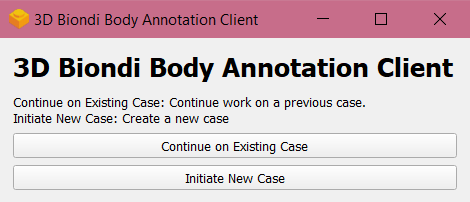
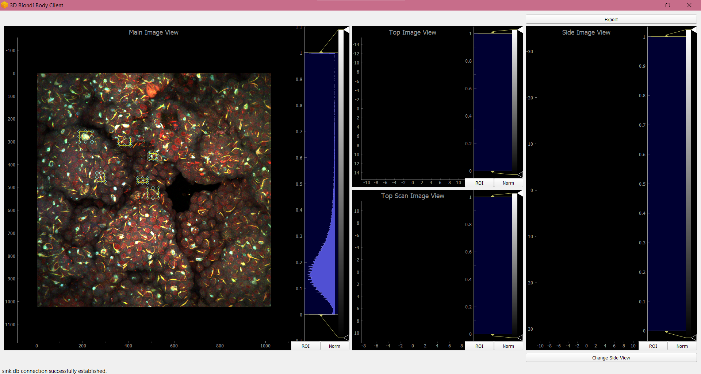
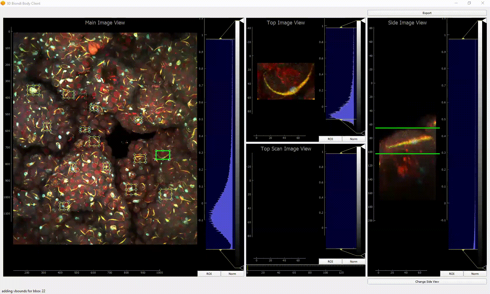

# 3D Biondi Body Annotation Client

#### Author: Jacqueline Tiffany Yeung (jackieo168)
A client used to annotate and record the 6 rectangular box boundary dimensions of biondi bodies in 3D images of the choroid plexus.

## Installation
Click on the `.exe` file in the latest release to download the installer.  
Install the client close to where your data is located.

## Usage

### Opening window:

### Initiate new case:
Begins a fresh annotation case.  
Entries:  
- **Image Array Path (.npy)**: input image. NumPy array with dimensions `(depth, height, width, num_channels)`.  
- **Sink Directory (folder)**: directory of sink database, the file to which your annotations will be saved.  
- **Sink Database Name**  

  
Upon clicking `OK`, the main annotation window will open.

### Continue existing case:
Continues an existing annotation case. Loads existing annotations from a provided source database.  
  
Upon clicking `OK`, the main annotation window will open, with existing annotations loaded.  

### Overview of the different image views:  
- **Main Image View**: displays the max intensity z-projection of the input image Numpy array. This is where you add your bboxes.
- **Top Image View**: displays the selected region of main image.
- **Top Scan View**: the same, with a toggle at the bottom to allow you to scan through the selected region depthwise. 
- **Side Image View**: displays the max x- and y-projections (2 side views) of the selected region. You can toggle between views by clicking the `Change Side View` button at the bottom right. Use the `Top Scan View` to aid in vbound annotation.  

### Add annotation:
Click on the `Main Image View` to add a bbox (bounding box).  
Adjust the bbox by dragging its handles. You can zoom in/out by scrolling and pan by clicking and dragging.   
Click on the added bbox to view the `Top`, `Top Scan`, and `Side` views.  
Click on the `Side Image View` to add vbounds (vertical bounds).
  

### Delete annotation:
Right click on the desired bbox. Click `Remove ROI`.

### Export annotations:
Click the `Export` button at the top right. Enter in the destination folder and `.csv` name within the dialog that pops up.  
  
Annotations are saved in the following format `(bbox_id, row_start, row_end, col_start, col_end, z_start, z_end)`:
- `bbox_id`: unique identifier of annotation.
- `row_start`: starting index of the bbox, height-wise.
- `row_end`: ending index of the bbox, height-wise.
- `col_start`: starting index of the bbox, width-wise.
- `col_end`: ending index of the bbox, width-wise.
- `z_start`: top vbound index.
- `z_end`: bottom vbound index.

## Warnings/Important things to note:
- All changes are autosaved.
- When initiating a new case, if the provided sink database already exists, any existing `annotations` table within that database will be cleared immediately upon opening of the main window.
- When continuing an existing case, if the provided sink database is different than the source database, any added annotations will only be added to the sink (obvious, but be careful).
- If you open multiple annotation cases that write to the same sink database, things will get messed up. Avoid doing this.

## Acknowledgements
This client was built for the [Monuki Lab at UC Irvine](https://faculty.sites.uci.edu/monukilab/) as a tool for their study of [choroid plexus pathology](https://faculty.sites.uci.edu/monukilab/choroid-plexus-pathology/).  
Work done by William Huang (whuang37) on other [pathology clients](https://github.com/mjneel/pathology_clients) was referenced for the creation of this client.  
Libraries used: PyQt5, PyQtGraph, NumPy.

## Bugs
For any bugs/issues, please add a new issue [here](https://github.com/jackieo168/biondi_3Dbox_client/issues/new) with details on the bug and how to reproduce it.  
Thank you! :)